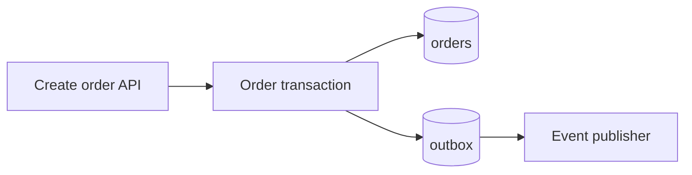

# Complete data asset example

The values are illustrative; replace them with cited source evidence.

````markdown
---
type: Database Table
title: Orders
description: Stores one row per accepted order.
resource: "postgresql://commerce/orders"
tags: [orders, transactional]
timestamp: 2026-07-12T09:00:00Z
---

# Overview

One row represents one accepted order. Records remain online for 90 days and are then archived for seven years.

# Schema

| Field | Type | Description |
|---|---|---|
| id | uuid | Stable order identifier and primary key. |
| tenant_id | uuid | Owning tenant. |
| status | text | Current order lifecycle state. |
| total_minor | bigint | Total in the currency's minor unit. |
| created_at | timestamptz | Acceptance time in UTC. |

# Access Paths

- Create order inserts every field through `OrderRepository.insert`.
- Get order reads by `(tenant_id, id)`.
- Archive orders scans `created_at` in bounded batches and deletes archived rows.

# Indexes and TTL

- Primary key: `(id)`.
- Lookup index: `(tenant_id, id)`.
- Archive index: `(created_at)`.
- PostgreSQL has no row TTL; the archive worker enforces 90-day online retention.

# Transactions and Consistency

The order and outbox event are inserted atomically in one read-committed transaction. Readers do not observe uncommitted rows.

# Relationships

`order_items.order_id` references `orders.id`. Tenant isolation also requires matching `tenant_id` in repository predicates.

# Impact

| Operation | Fields | Effect |
|---|---|---|
| Create order | `id`, `tenant_id`, `status`, `total_minor`, `created_at` | Inserts one row and an outbox event. |
| Cancel order | `status` | Updates `status`; downstream publisher emits the new state. |
| Archive orders | all | Reads, archives, then deletes eligible rows in batches. |

# Examples

```sql
SELECT id, status, total_minor
FROM orders
WHERE tenant_id = $1 AND id = $2;
```

# Data Flow



# Citations

[1] [Orders migration](../../migrations/0042_orders.sql#L1)
[2] [Order repository](../../src/orders/repository.rs#L20)
[3] [Archive worker](../../src/orders/archive.rs#L31)
````
