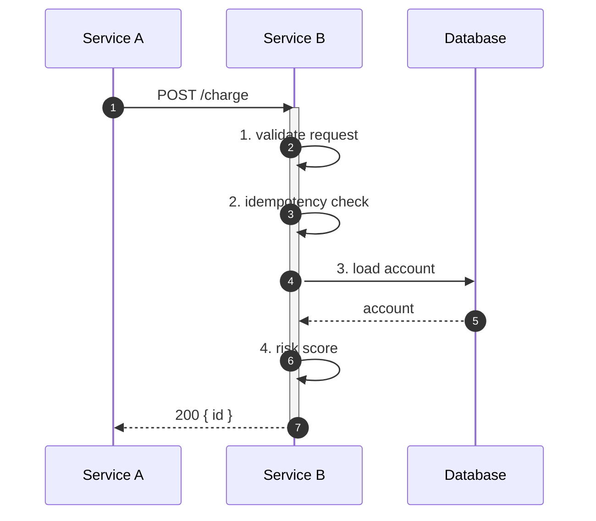
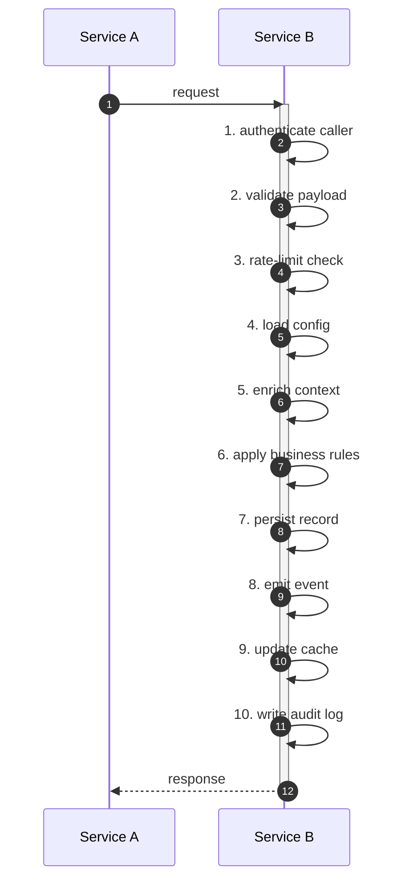
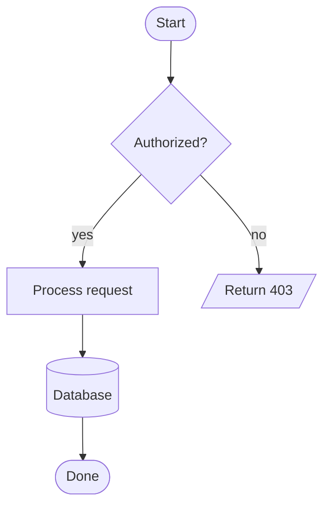
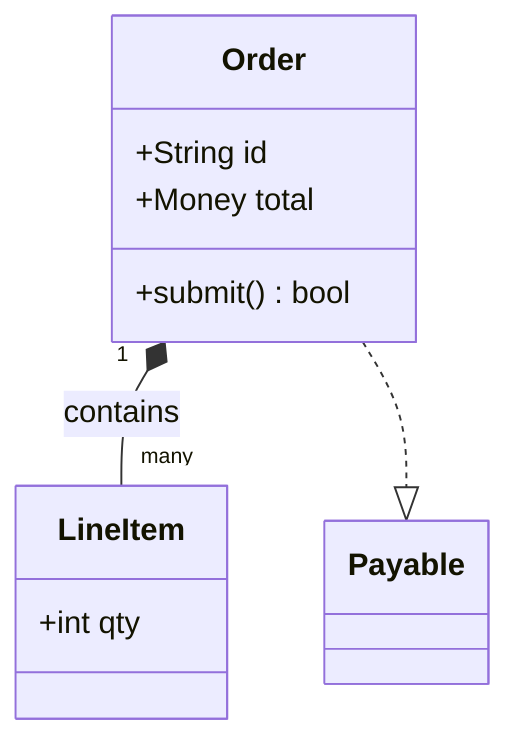
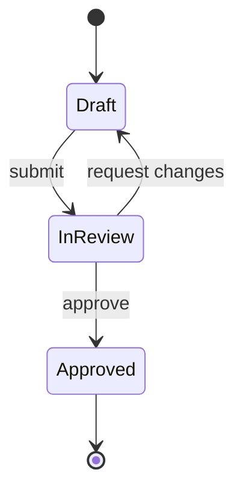
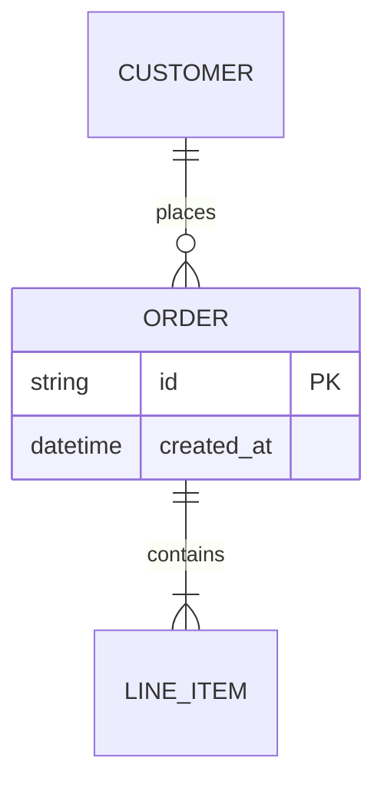

# Mermaid cheat sheet (for canvas diagrams)

A `mermaid` node (`{ kind: "mermaid", mermaid: { src } }`) packs an entire
diagram into one node — the densest, most reliable way to draw on the canvas.
This is a quick syntax reference for the five diagram types Canvas Studio
renders, plus the **fan-out pattern** that keeps complex flows honest.

> Golden rule: **be exhaustive.** If a step fans out into N sub-steps, emit all N
> as distinct messages/nodes — never collapse "B does 10 things" into one box.
> The assist engine's prompt demands this; your hand-written diagrams should too.

---

## Sequence diagram (`sequenceDiagram`) — service-to-service flows

The default choice for "service A calls service B" stories.

Arrows: `->>` (solid call), `-->>` (dashed reply), `-x` (lost message), `-)`
(async). Self-message (`B->>B: …`) renders a step on B's own lifeline — **use one
self-message per sub-step** to show fan-out. Wrap a multi-step span in
`activate B` / `deactivate B` (or `B->>B:` lines). Extras: `autonumber`,
`Note over B: …`, `alt/else/end`, `opt/end`, `loop N times … end`, `par … and …
end`, `critical … end`.

### The fan-out pattern ("B does 10 things")

When asked "service A calls service B, and B does 10 things", emit **all 10** as
distinct self-messages on B (numbered), not a single "B processes" box:

(See `examples/service-fanout.md` for the full create-scene + add-mermaid run.)

---

## Flowchart (`flowchart TD` / `LR`) — decisions & branches

Directions: `TD`/`TB` (top-down), `LR`, `RL`, `BT`. Node shapes: `[rect]`,
`(round)`, `([stadium])`, `{diamond}`, `{{hexagon}}`, `[(database)]`,
`[/parallelogram/]`. Links: `-->`, `---`, `-- label -->`, `-.->` (dashed),
`==>` (thick). Group with `subgraph name … end`.

---

## Class / UML (`classDiagram`)

Relations: `<|--` (inheritance), `*--` (composition), `o--` (aggregation), `-->`
(association), `..>` (dependency), `..|>` (realization). Member prefixes: `+`
public, `-` private, `#` protected.

---

## State diagram (`stateDiagram-v2`)

`[*]` is the start/end pseudo-state. Composite states: `state Name { … }`.
Annotate transitions with `: event`.

---

## Entity-relationship (`erDiagram`)

Cardinality (left/right): `||` exactly one, `o{`/`}o` zero-or-many, `|{`/`}|`
one-or-many, `o|`/`|o` zero-or-one. Attribute block: `ENTITY { type name PK/FK }`.

---

## Tips for canvas-ready diagrams

- **Prefer `assist`** to draft mermaid from a prompt, then `add-mermaid` the
  returned `src` (set `mode: "sequence"|"flow"|"uml"` to steer the type).
- Keep one diagram per `mermaid` node; size ~`w:520, h:360` and grow `h` for tall
  sequences.
- Set the payload `kind?` hint (`sequence`/`flowchart`/`class`/`state`/`er`) so
  the renderer and slide playback know how to step it.
- For **step-by-step presentation**, sequence diagrams are special: a slide's
  `mermaidMessageRange` reveals messages incrementally (see
  `examples/sequence-to-slides.md`).
- Escape newlines as `\n` when embedding `src` in JSON over HTTP; the `canvas.mjs`
  helper takes a raw multi-line string and encodes it for you.
