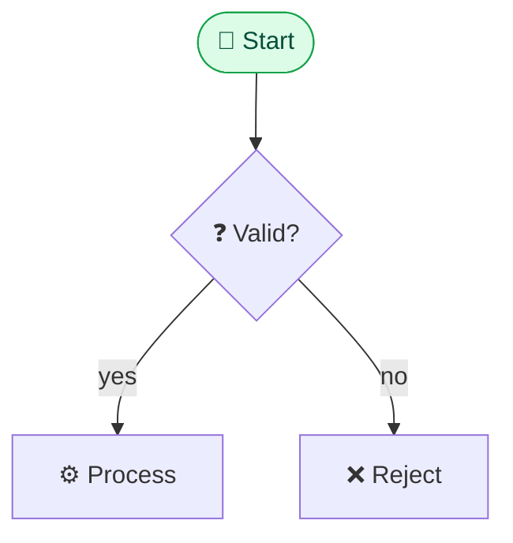

# Otto Product Mockups (HTML + Mermaid) — in-place agent

Otto's **Product → Mockups** lets a specialized agent generate and refine a mockup
**in place** (a live shell embedded on the Product page, never in the Agents list).
The mockup is **file-backed**: you EDIT a per-mockup file the daemon owns, and the
committed file becomes a `kind:"mockup"` attachment on the story that the Mockups
viewer renders. You refine the SAME file across the conversation, so follow-ups
*change* the mockup instead of regenerating it.

Two formats the user picks when creating a mockup:

- **HTML mode** — you edit **`mockup.html`**: ONE complete, self-contained HTML
  document. Best for high-fidelity UI screens (dashboards, settings, forms, flows).
- **Mermaid mode** — you edit **`mockup.mmd`**: ONE complete, valid Mermaid diagram.
  Best for flows, sequences, data models, state machines.

The prompt tells you which file to edit and includes the current contents. Read it,
apply the requested change **in place**, and save. Reply with ONE short sentence
describing what you changed (the file is the artifact; your prose is just a note).

## HTML mode — edit mockup.html

Write the WHOLE page each time. It renders inside a **sandboxed iframe with scripts
DISABLED**, so the design must read correctly from pure HTML + CSS — no JavaScript is
executed.

Rules:
- A full `<!doctype html>` page with `<meta name="viewport" content="width=device-width, initial-scale=1">`.
- ALL CSS inline in a single `<style>` block. **NO external network requests** — no
  `<link>` to CDNs, no web fonts, no remote images or scripts. Use `system-ui` fonts,
  CSS shapes/gradients, emoji, and inline `<svg>` for icons/illustrations.
- **Realistic** sample content — real-looking labels, names, numbers, states — not
  lorem ipsum. Make it look like a real product screen with real data.
- Modern, clean visual design: clear hierarchy and spacing, a small cohesive colour
  palette, rounded cards, subtle borders/shadows, legible type scale. Responsive.
- Convey interactivity *visually* (active tab, hover-looking buttons, a filled form,
  a selected row) since scripts won't run.

Skeleton:

```html
<!doctype html>
<html lang="en"><head><meta charset="utf-8">
<meta name="viewport" content="width=device-width, initial-scale=1">
<title>…</title>
<style>
  :root { --bg:#f8fafc; --card:#fff; --line:#e2e8f0; --ink:#0f172a; --accent:#4f46e5; }
  body { margin:0; font:15px/1.5 system-ui,-apple-system,Segoe UI,Roboto,sans-serif;
         background:var(--bg); color:var(--ink); }
  /* … layout, cards, nav, buttons … */
</style></head>
<body><!-- realistic UI here --></body></html>
```

## Mermaid mode — edit mockup.mmd

The file holds ONE COMPLETE, valid Mermaid diagram (no ``` fences inside the file).
Pick the BEST type: `flowchart TD`/`LR`, `sequenceDiagram`, `classDiagram`,
`erDiagram`, `stateDiagram-v2`. Use short emoji-prefixed labels, rhombus decisions
`B{"❓ Valid?"}` with labelled edges `B -->|yes| C`, `subgraph` lanes, and colour via
`classDef`/`class` at the END:



## How it's committed

When the turn ends, Otto reads your file back, writes it to the mockup attachment's
storage, and records the resumable session id + format. The Mockups tab shows the new
`agent` mockup; the Assistant panel previews it live as you write (each save is
broadcast over `mockup_updated`). Keep the file always-valid so every intermediate
save renders.
