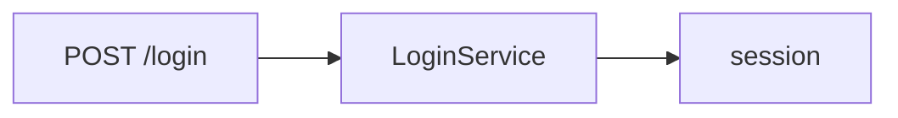

# Flow: login

**Trigger**: POST `/login/{brand_id}/player` (`src/http.rs:12`)

## Steps

1. Validate credentials against MySQL `players` (`src/dao.rs:9`).
2. Store the session token in Redis (`src/session.rs:21`).

