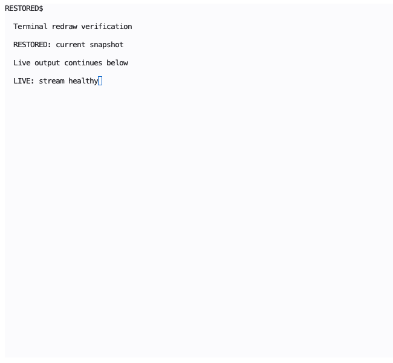
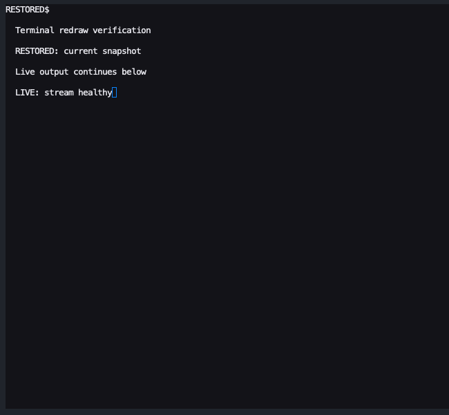
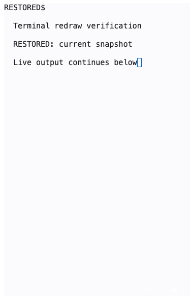

# Terminal snapshot redraw regression

The daemon replaces a viewer's output subscription when it captures a scrollback
snapshot. The UI previously discarded a delayed optional compact if a selection
or scrollback reading position became active after the request. Those updates
then existed only in the discarded snapshot, leaving stale cells and missing
output in both visible and parked terminals.

The fix always applies received snapshots. Optional compacts still check for a
selection or scrollback reading position before sending their request. A selection
started while a snapshot is already in flight can be cleared by that rebuild.

## Verification

- The new visible and parked selection-race tests failed on WebKit before the fix:
  F1 rows remained instead of the expected F2 rows.
- Chromium and WebKit cover JSON and binary snapshots, park/adopt, transient
  resize, and explicit Redraw. The parked test inspects the parked buffer
  before adoption, verifying that the parked handler consumed the snapshot and
  following live output.
- UI type/guard checks, all 1,900 UI unit tests, and workspace clippy passed.

Run the focused browser suite from `ui/`:

```sh
npx playwright test --config playwright.terminal-links.config.ts desktop-terminal-park-redraw
```

## Rendered evidence

WebKit screenshots of the real Terminal component after explicit redraw replaces
a deliberately garbled frame. A mocked daemon supplies protocol-correct snapshots;
these are not captures of user sessions. Desktop viewport: 1440 x 900; phone:
390 x 900. Screenshots crop to the terminal, with fixture-only adjacent panels
hidden for the phone capture.




