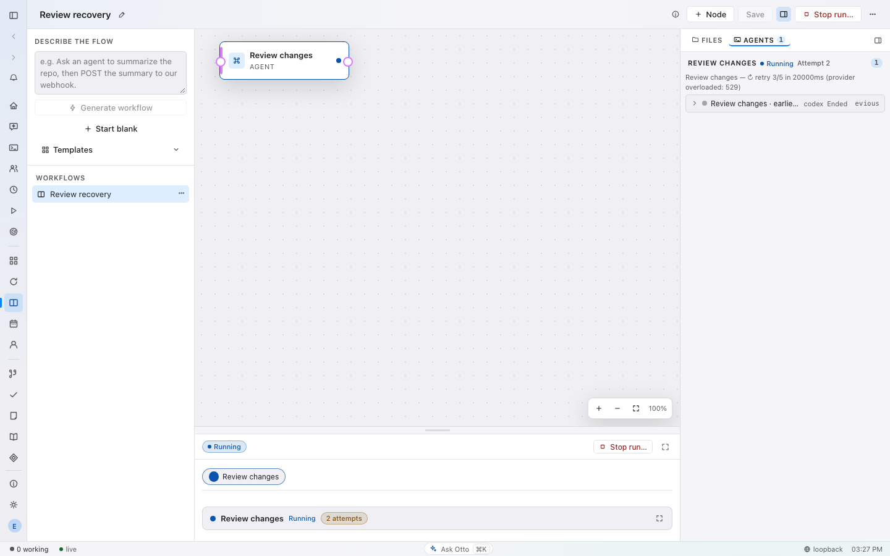
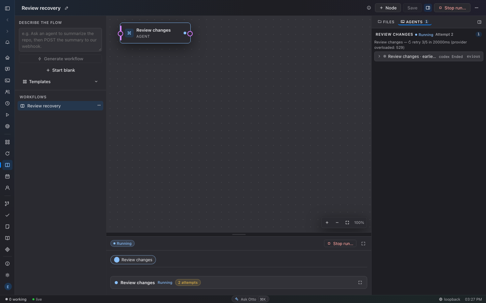

# Agent recovery regression coverage

The recovery sweep covers workflow loops and the engines that share agent
sessions, result files, retry policies, and startup recovery. A completed child
must not be relaunched merely because a later quality gate failed. An interrupted
or incomplete child must not appear successful or continue after its owner stops.

## Required behavior

| Area | Recovery invariant | Regression coverage |
| --- | --- | --- |
| Workflow loops | A failed iteration cannot satisfy `until` using the previous iteration's output. | `workflow_engine::recovery_tests` |
| Workflow reviews | Persist the child association before dispatch; reuse completed reviews only for the same input, checkout, diff and configuration. Preserve failed quality-gate evidence without execution retries. | `workflow_engine::recovery_tests`, `modules::review_launch_recovery_tests`, checkpoint tests |
| Workflow deadlines | The active execution budget covers inner attempts and retry delays; human approval pauses accounting. Retire each failed attempt before retry. | `active_budget_interrupts_inflight_node_and_retires_durable_child_review`, `inner_retry_waits_for_owned_session_and_review_cleanup`, budget and checkpoint tests |
| Shared result files | Empty/truncated JSON is retained while the producer writes. A valid empty findings array is a successful clean review. | `otto-agent-run` result-file tests |
| Shared session turns | Capture transcript boundaries before submitting; use a unique validated final reply across providers. Silence is not completion. A missing required result fails after native completion grace. | `agent_session::tests`, `agent_session::reply::tests`, turn-oracle tests |
| Session ownership | Cancellation during admission cannot leak a late session or kill a successor using the same session. Hold the ownership lease through asynchronous cleanup. | `agent_session::lifecycle::tests` |
| Run with Otto | A review deadline stops the owned review. Stop on an already-failed parent still retires its owned children and preserves the failed outcome. | `run_engine::tests`, `run_service::tests` |
| Goal loops and scheduled tasks | Runtime limits cover active work. A retried executor resumes evaluation without replaying the fleet. Workflow admission and parent linkage commit atomically with cancellation checks. | goal-loop recovery tests and state `recovery_handoff` tests |
| Swarm | Route saved successful results after restart; preserve passed goals; honor pause/cancel before verification and merge. Merge failure blocks dependencies. The last admitted run may finish. | Swarm runtime suites and state Swarm recovery tests |
| Product | One owner spans an agent attempt, its publication and Stop. Persist replacement Discovery session IDs. | Product attempt-ownership, cancellation and Discovery tests |
| Canvas and Design | Persist replacement sessions; require final output; restore the current saved artifact under the publication lock. | Canvas assist regressions and Design assist tests |
| Vault and Skills | Reject incomplete results, isolate attempts, bound retry admission, recover abandoned rows before new work, and recompute retry aggregates. | Vault docs, skill review/evaluation and state recovery tests |
| Personal agents and reminders | Stale schedule snapshots cannot dispatch or consume a newly edited occurrence. Reminder notice, thread entry and completion settle atomically. | state personal-agent and assistant recovery tests |
| Insights and Self Improvement | Collection files and HTML alone do not prove final completion. Serialize improvement admission and settle against current settings. | Insights recovery tests, improvement admission/settings tests |
| UI | Continue observing long analyses; ignore responses owned by an earlier selection or a pre-Stop list request. | `ui/unit/recoveryOwnership.test.ts` |

## State compatibility

Migration `0182_personal_agent_dispatch_generations.sql` adds defaulted generation
columns and triggers. Existing columns and tables remain available to older
builds. Goal-loop continuation and Swarm routing checkpoints use compatible JSON
fields. Startup settlement runs before resumed workflows or background schedulers
can admit fresh work in another engine.

## Verification boundary

Regression tests use temporary state, fake hosts/providers, and isolated child
processes. Browser checks use the throwaway E2E daemon. They do not stop, resume,
modify, or deploy to a user's remote daemon. A source fix and a successful merge
are distinct from deploying it to the remote computer that reported the incident.

Coverage combines state-backed regressions, production helper tests and source
traces; it is not a complete live-provider recovery simulation. In particular,
Personal Agents startup ordering is source-verified, and Skills timeout cleanup
and failed-implementation dispatch have helper coverage rather than a complete
fake-session lifecycle test. Review adoption tests exercise identical inputs;
changed diff/configuration rejection is also reviewed at the identity check.

## Browser evidence

The synthetic running-workflow fixture verifies that the current attempt, retry
delay and provider error stay readable before the run finishes. It exercises the
real Workflows page with mocked run snapshots and no live provider.

## Local verification (2026-10-08)

- Full workspace clippy with `-D warnings`, rustfmt, LOC ratchet and macOS CI
  coverage guard passed.
- Workspace nextest ran 5,562 tests: 5,557 passed initially and five failed.
  Four existing push fixtures inherited global Git URL rewrites; the fifth was
  the new workflow fixture's bare Git command, corrected to the hardened helper.
  All five failures and the workflow recovery cases passed in an 11-test rerun
  with `GIT_CONFIG_GLOBAL=/dev/null GIT_CONFIG_NOSYSTEM=1`. The full run left
  94 explicitly ignored tests skipped; no real-provider tests were enabled.
- Workspace production build and documentation tests passed (one ignored example).
  The macOS debug linker emitted its large unwind-table warning; linking succeeded.
- UI checks passed with zero errors/warnings, all 1,832 unit tests passed, and
  the production UI build passed.
- Eleven browser tests passed across seven named workflow, Product and Swarm
  specs. After visual review found retry-text truncation, the stronger retry
  spec reproduced the failure and passed with wrapping in both themes.

No full Playwright run or remote deployment was performed.

## CI follow-up: offline Vault completion

The first CI run passed Linux/macOS Rust, CodeQL, smoke/performance, and three
functional browser shards. The fourth shard exposed two Vault API fixture
failures: the offline runner returned `OK` without publishing the newly required
author manifest. Both failures reproduced locally.

The offline adapter now publishes explicit empty author/reviewer results and a
valid completion marker at server-owned temporary paths. It does not author
notes or relax production validation. Two tests use the real writer, summarizer,
revision and reviewer prompts; another assertion rejects paths embedded in user
content. Both new tests and all 40 tests in the Vault agent test module pass.
Full workspace clippy and the production build pass after this correction.
The two full named Vault browser specs also pass: 10 tests, no retries or skips.
